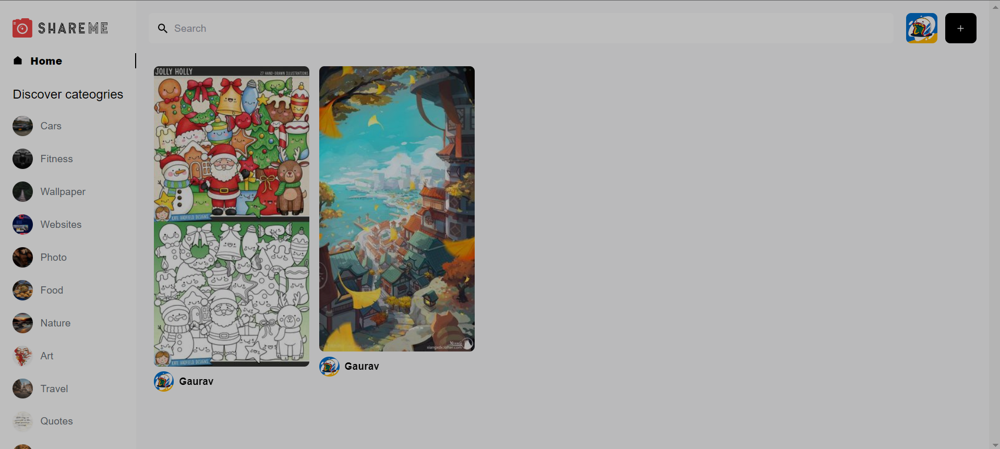
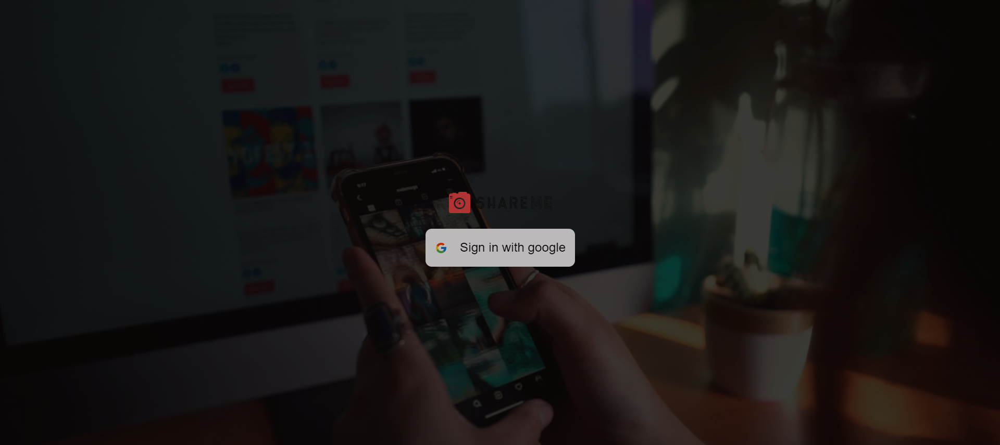
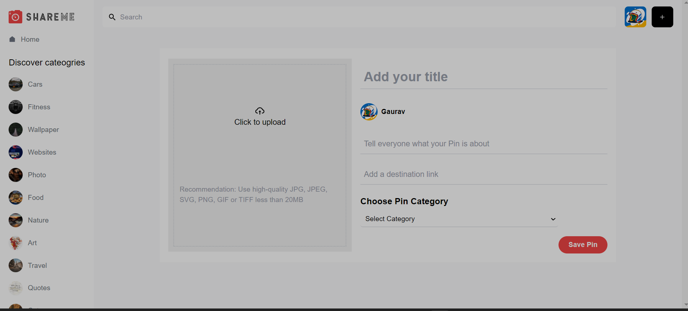
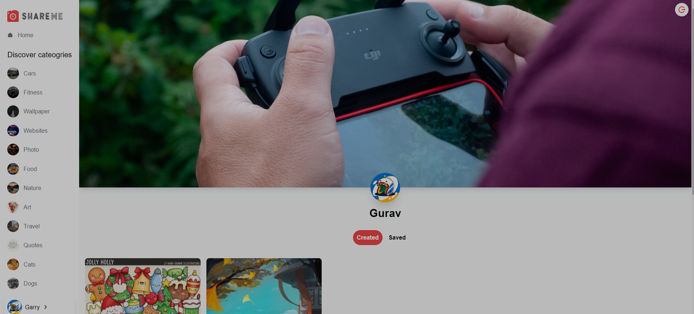

# Shareme App (Learning (by Javascript Mastery))

- deployed url : https://shareme-socialmediaappp.netlify.app/

# Screenshots

# Features 
- add Post (images and text)
- Delete Post
- view post
- save post
- comment
- google login and logout
- profile page (shows saved post and created post)

# tech stacks
- sanity
- reactjs
- firebase (for authentication only)
- tailwindcss

